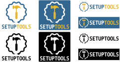

=======
Artwork
=======

   Setuptools logo, designed in 2021 by `Anderson Bravalheri`_

Elements of Design
==================

The main colours of the design are a dark pastel azure (``#336790``) and a pale
orange (``#E5B62F``), referred in this document simply as "blue" and "yellow"
respectively. The text uses the *Monoid* typeface, an open source webfont that
was developed by Andreas Larsen and contributors in 2015 and is distributed
under the MIT or SIL licenses (more information at
https://github.com/larsenwork/monoid)

Usage
=====

The preferred way of using the setuptools logo is over a white (or light)
background. Alternatively, the following options can be considered, depending
on the circumstances:

- *"negative"* design - for dark backgrounds (e.g. website displayed in "dark
  mode"): the white colour (``#FFFFFF``) of the background and the "blue"
  (``#336790``) colour of the design can be swapped.
- *"monochrome"* - when colours are not available (e.g. black and white printed
  media): a completely black or white version of the logo can also be used.
- *"banner"* mode: the symbol and text can be used alongside depending on the
  available space.

The following image illustrate these alternatives:

Please refer to the SVG files in the `setuptools repository`_ for the specific
shapes and proportions between the elements of the design.

Working with the Design
=======================

The `setuptools repository`_ contains a series of vector representations of the
design under the ``docs/images`` directory. These representations can be
manipulated via any graphic editor that support SVG files,
however the free and open-source software Inkscape_ is recommended for maximum
compatibility.

When selecting the right file to work with, file names including
``editable-inkscape`` indicate "more editable" elements (e.g. editable text),
while the others prioritise SVG paths for maximum reproducibility.

Also notice that you might have to `install the correct fonts`_ to be able to
visualise or edit some of the designs.

Inspiration
===========

This design was inspired by :user:`cajhne`'s `original proposal`_ and the
ancient symbol of the ouroboros_.
It features a snake moving in a circular trajectory not only as a reference to
the Python programming language but also to the `wheel package format`_ as one
of the distribution formats supported by setuptools.
The shape of the snake also resembles a cog, which together with the hammer is
a nod to the two words that compose the name of the project.

License
=======

This logo, design variations or a modified version may be used by anyone to
refer to setuptools, but does not indicate endorsement by the project.

Redistribution, usage and derivative works are permitted under the same license
used by the setuptools software (MIT):

.. code-block:: text

   Copyright (c) Anderson Bravalheri

   Permission is hereby granted, free of charge, to any person obtaining a copy
   of this software and associated documentation files (the "Software"), to
   deal in the Software without restriction, including without limitation the
   rights to use, copy, modify, merge, publish, distribute, sublicense, and/or
   sell copies of the Software, and to permit persons to whom the Software is
   furnished to do so, subject to the following conditions:

   The above copyright notice and this permission notice shall be included in
   all copies or substantial portions of the Software.

   THE SOFTWARE IS PROVIDED "AS IS", WITHOUT WARRANTY OF ANY KIND, EXPRESS OR
   IMPLIED, INCLUDING BUT NOT LIMITED TO THE WARRANTIES OF MERCHANTABILITY,
   FITNESS FOR A PARTICULAR PURPOSE AND NONINFRINGEMENT. IN NO EVENT SHALL THE
   AUTHORS OR COPYRIGHT HOLDERS BE LIABLE FOR ANY CLAIM, DAMAGES OR OTHER
   LIABILITY, WHETHER IN AN ACTION OF CONTRACT, TORT OR OTHERWISE, ARISING
   FROM, OUT OF OR IN CONNECTION WITH THE SOFTWARE OR THE USE OR OTHER DEALINGS
   IN THE SOFTWARE.

   THE USAGE OF THIS LOGO AND ARTWORK DOES NOT INDICATE ENDORSEMENT BY THE
   SETUPTOOLS PROJECT.

Whenever possible, please make the image a link to
https://github.com/pypa/setuptools.

.. _Anderson Bravalheri: https://github.com/abravalheri
.. _Inkscape: https://inkscape.org
.. _setuptools repository: https://github.com/pypa/setuptools
.. _install the correct fonts: https://wiki.inkscape.org/wiki/Installing_fonts
.. _original proposal: https://github.com/pypa/setuptools/issues/2227#issuecomment-653628344
.. _wheel package format: https://www.python.org/dev/peps/pep-0427/
.. _ouroboros: https://en.wikipedia.org/wiki/Ouroboros
