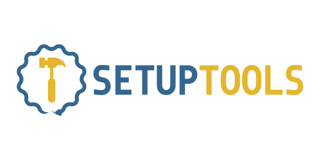

Documentation
=============

Setuptools is a fully-featured, actively-maintained, and stable library
designed to facilitate packaging Python projects.

.. toctree::
   :maxdepth: 1
   :hidden:

   User guide <userguide/index>
   build_meta
   pkg_resources
   references/keywords
   setuptools

.. toctree::
   :caption: Project
   :maxdepth: 1
   :hidden:

   roadmap
   Development guide <development/index>
   Backward compatibility & deprecated practice <deprecated/index>
   Changelog <history>
   Artwork <images/README>

.. tidelift-referral-banner::
